# 04 - Browser Feasibility Spike & PWA Blueprint: KNOT Tier 1

> Inputs: `00-context.md`, `01-scope.md`, `02-hypotheses.md`, `03-loop.md`
> Role: Senior Web Platform & PWA Engineer
> Scope: Uncompromising browser feasibility across Android (Chromium) & iOS (WebKit/Safari), camera anti-cheat pipelines, notification reality checks, and PWA architecture.

---

## 1. Camera Capture & Anti-Cheat Pipeline

KNOT's verification model relies on **live action capture** to prevent performative productivity and pre-saved photo uploads. On the open web, capturing sensor data requires navigating major divergence between Android Chromium and iOS WebKit.

### 1.1 Live Capture Flow: `getUserMedia()` vs. HTML5 `<input capture>`

Two web mechanisms can access a device's camera:

```mermaid

graph TD

subgraph OptionA["OPTION A: In-App Viewfinder (MediaDevices.getUserMedia) [RECOMMENDED]"]

A1[User taps Check-In] --> A2[Browser prompts camera permission]

A2 --> A3[Inline &lt;video&gt; stream renders]

A3 --> A4[User taps Snap]

A4 --> A5[Frame drawn to &lt;canvas&gt;]

A5 --> A6[Stream stopped]

end

  

subgraph OptionB["OPTION B: Native Camera Intent (HTML5 &lt;input capture='environment'&gt;)"]

B1[User taps Check-In] --> B2[OS opens native Camera App]

B2 --> B3[User takes photo]

B3 --> B4[Returns file]

end

  

%% Styling to match the original box layout structure

style OptionA fill:#fff,stroke:#333,stroke-width:1px

style OptionB fill:#fff,stroke:#333,stroke-width:1px

  

```



#### Cross-Platform Behavioral Comparison

| Platform / Browser | `MediaDevices.getUserMedia()` | `<input type="file" accept="image/*" capture="environment">` |
| :--- | :--- | :--- |
| **Android Chrome (Chromium)** | **Full Support.** Requests `android.permission.CAMERA` via browser sandbox. Streams directly into inline `<video>`. Viewfinder is fully customisable via HTML/CSS. | Launches native camera intent directly. On some Android OEM ROMs, the intent chooser still presents an option to open the **Files / Gallery** app, bypassing live capture. |
| **iOS Safari (WebKit)** | **Full Support (with quirks).** Must set `playsinline` and `muted` attributes on `<video>`, or iOS hijacks the stream into the native fullscreen AV player. Requires HTTPS. Stream freezes immediately if the user switches apps. | Launches native iOS camera interface. iOS strictly enforces camera mode and suppresses photo library selection **only if** `capture="environment"` is specified. |
| **Desktop (Chrome / Safari / Firefox)** | **Full Support.** Prompts for webcam access. Streams directly to canvas. Zero gallery access paths exist in the DOM. | **Fails completely.** Desktop browsers completely ignore the `capture` attribute and open the OS file manager dialog (Finder / File Explorer), enabling arbitrary file uploads. |

#### Architectural Decision for Tier 1: `getUserMedia()` with In-DOM Canvas

We select **`MediaDevices.getUserMedia()`** as the primary pipeline:
1. It eliminates `<input type="file">` entirely from the DOM, guaranteeing zero file-picker fallback on desktop and laptop browsers.
2. It allows a custom, branded viewfinder overlay with framing guides and countdown indicators.
3. If camera permission is denied or unsupported (e.g. legacy webview), the app triggers an explicit error state rather than falling back to file upload.

---

### 1.2 Viewfinder Implementation & Stream Lifecycle (Client-Side)

```typescript
// lib/camera/useCamera.ts
export async function startCameraStream(videoElement: HTMLVideoElement): Promise<MediaStream> {
  if (!navigator.mediaDevices?.getUserMedia) {
    throw new Error('CAMERA_UNSUPPORTED: MediaDevices API not available.');
  }

  const constraints: MediaStreamConstraints = {
    audio: false,
    video: {
      facingMode: { ideal: 'environment' }, // Back camera preferred on mobile
      width: { ideal: 1280 },
      height: { ideal: 720 },
    },
  };

  const stream = await navigator.mediaDevices.getUserMedia(constraints);
  videoElement.srcObject = stream;
  
  // Mandatory for iOS Safari to prevent fullscreen hijacking:
  videoElement.setAttribute('playsinline', 'true');
  videoElement.setAttribute('muted', 'true');
  await videoElement.play();

  return stream;
}

export function stopCameraStream(stream: MediaStream | null): void {
  if (!stream) return;
  stream.getTracks().forEach((track) => track.stop()); // Release hardware sensor
}
```

---

### 1.3 Image Processing Pipeline: Compression & EXIF Stripping

To keep proof submissions under the **200 KB** payload threshold on weak mobile connections and protect user privacy:

1. **Downscaling:** Render video frame onto an in-memory `<canvas>` constrained to a maximum width of **1280px** (preserving aspect ratio).
2. **EXIF Stripping:** Drawing raw pixel raster buffers directly onto an HTML5 canvas **intrinsically strips all EXIF metadata** (GPS coordinates, camera model, lens parameters, original device timestamps).
3. **JPEG Encoding:** Export canvas buffer using `canvas.toBlob('image/jpeg', 0.70)`.

```typescript
// lib/camera/processSnapshot.ts
export interface ProcessedSnapshot {
  blob: Blob;
  width: number;
  height: number;
  sizeBytes: number;
}

export async function processSnapshot(video: HTMLVideoElement): Promise<ProcessedSnapshot> {
  const MAX_WIDTH = 1280;
  let { videoWidth: width, videoHeight: height } = video;

  // Scale down if frame exceeds maximum bounding width
  if (width > MAX_WIDTH) {
    height = Math.round((height * MAX_WIDTH) / width);
    width = MAX_WIDTH;
  }

  const canvas = document.createElement('canvas');
  canvas.width = width;
  canvas.height = height;
  const ctx = canvas.getContext('2d');

  if (!ctx) throw new Error('CANVAS_CONTEXT_FAILED');

  // Rasterize frame (strips EXIF automatically)
  ctx.drawImage(video, 0, 0, width, height);

  return new Promise((resolve, reject) => {
    canvas.toBlob(
      (blob) => {
        if (!blob) return reject(new Error('COMPRESSION_FAILED'));
        resolve({
          blob,
          width,
          height,
          sizeBytes: blob.size,
        });
      },
      'image/jpeg',
      0.70 // 70% quality: achieves ~80KB - 160KB typical size
    );
  });
}
```

*Payload Benchmark:* A 1280x720 video frame compressed at `0.70` JPEG quality yields **85 KB – 140 KB**, well within the **< 200 KB** requirement.

---

### 1.4 The Anti-Cheat Reality: Client Limits vs. Cryptographic Truth

> [!WARNING]
> **The Analog Hole & Client-Side Sandbox Limitations**
> No browser sandbox running in JavaScript can determine whether the camera sensor is pointed at an authentic physical workspace or pointed at a laptop screen displaying a photograph taken three months ago. Virtual camera spoofers (e.g., OBS Virtual Cam) can also mimic device hardware on desktop environments.

#### The Real Defense Layer

KNOT does not rely on naive client-side security. The integrity model is protected by two server-side and social barriers:

1. **Server-Generated Cryptographic Timestamping:**
   - The check-in timestamp is set exclusively by PostgreSQL (`now()`) upon receiving the multipart upload.
   - Client clocks and local time modifications are completely disregarded.
   - Proofs can only be submitted within the open active submission window.
2. **Zahavi's Honest Signaling & Peer Bluff Calls:**
   - The accountability partner inspects the context and ambient cues (lighting, angle, screen reflections).
   - If a proof appears staged or recycled, the partner clicks **Call Larp / Bluff**.
   - Social reputational consequence and mutual dependency enforce authenticity where software sandboxes cannot.

---

## 2. Web Push, Badging, and Notification Reality Check

Timely notifications are critical for the **2-Hour Silent Pass** review and the **24-Hour Rescue Window**. However, mobile web platforms treat background alerts very differently.

### 2.1 iOS Safari (WebKit) Push Requirements (iOS 16.4+)

Prior to iOS 16.4 (March 2023), Safari on iOS had zero support for the Web Push API. Starting in iOS 16.4, Apple introduced Web Push under **strict gatekeeping conditions**:

1. **Mandatory PWA Installation:** Web Push **only works if the web app is installed to the Home Screen** via the Safari Share menu (`Add to Home Screen`) and launched as a standalone display window. Regular browser tabs in mobile Safari *cannot* receive push notifications.
2. **Explicit User Gesture Required:** `Notification.requestPermission()` must be executed inside a direct user-initiated event (e.g., clicking a button labeled *"Enable Alerts"*). Calling it on page load or after an async delay throws an immediate security rejection.
3. **Apple Push Service (APNs) Gateway:** Push messages must be routed through Apple's push infrastructure using VAPID keys over WebPush protocol standards.

---

### 2.2 App Badging API (`navigator.setAppBadge`)

The Badging API displays an unread count on the application icon on the user's OS home screen or dock.

| OS / Browser | Support Status | Constraints |
| :--- | :--- | :--- |
| **Android Chrome** | **Supported** | Works out of the box when the PWA is installed via WebAPK. |
| **iOS Safari (WebKit)** | **Supported (iOS 16.4+)** | Only available on installed Home Screen PWAs. **Requires push notification permission to be granted first.** |
| **Desktop Chromium (Chrome/Edge)**| **Supported** | Displays numeric badge on OS taskbar/dock when installed. |
| **Desktop Safari** | **Supported (macOS 14 Sonoma+)** | Only works when web app is added to the macOS Dock. |

---

### 2.3 Tier 1 Fallback Strategy (In-App Only)

Because Web Push is explicitly excluded from the hackathon scope (`01-scope.md`), KNOT must deliver reliable notification states **without native background push**:

```
┌────────────────────────────────────────────────────────────────────────────────────────┐
│ TIER 1 IN-APP NOTIFICATION ARCHITECTURE                                                │
│                                                                                        │
│ 1. Window Focus Listener ──► App re-checks server state when user re-opens tab        │
│ 2. Polling Loop          ──► Fetches unread reviews & rescue counters every 10 seconds │
│ 3. Persistent UI Banner  ──► Sticky top drawer displays active countdowns & alerts    │
│ 4. Navigation Badges     ──► In-DOM counter dots on Knot cards                         │
└────────────────────────────────────────────────────────────────────────────────────────┘
```

#### Client Polling & Focus Sync Hook

```typescript
// lib/notifications/useInAppSync.ts
import { useEffect } from 'react';

export function useInAppSync(knotId: string, refreshCallback: () => void) {
  useEffect(() => {
    // 1. Immediately revalidate when tab gains focus or becomes visible
    const handleVisibilityChange = () => {
      if (document.visibilityState === 'visible') {
        refreshCallback();
      }
    };

    window.addEventListener('focus', refreshCallback);
    document.addEventListener('visibilitychange', handleVisibilityChange);

    // 2. Fallback polling loop (every 10s during active demo sessions)
    const interval = setInterval(refreshCallback, 10_000);

    return () => {
      window.removeEventListener('focus', refreshCallback);
      document.removeEventListener('visibilitychange', handleVisibilityChange);
      clearInterval(interval);
    };
  }, [knotId, refreshCallback]);
}
```

---

## 3. Focus Mode APIs (Tier 2.4 Focus Lockout)

For Tier 2.4 (In-App Focus Lockout) and deep work sessions, KNOT prevents device sleep and distraction tabs.

### 3.1 Screen Wake Lock API

The Screen Wake Lock API prevents mobile displays from auto-locking or dimming during an active Pomodoro or co-working session.

```typescript
// lib/focus/useWakeLock.ts
let wakeLockSentinel: WakeLockSentinel | null = null;

export async function requestScreenLock(): Promise<boolean> {
  if (!('wakeLock' in navigator)) {
    console.warn('WakeLock API not supported on this platform.');
    return false;
  }

  try {
    wakeLockSentinel = await navigator.wakeLock.request('screen');
    wakeLockSentinel.addEventListener('release', () => {
      wakeLockSentinel = null;
    });
    return true;
  } catch (err) {
    console.warn('WakeLock request failed or rejected by OS power management:', err);
    return false;
  }
}

export function releaseScreenLock(): void {
  if (wakeLockSentinel) {
    wakeLockSentinel.release();
    wakeLockSentinel = null;
  }
}
```

*Platform Matrix:*
- **Chrome Android:** Full support.
- **iOS Safari:** Supported in iOS 16.4+. Automatically released whenever the user switches tabs, minimizes Safari, or if device battery is critically low.
- **Re-acquisition Requirement:** On iOS Safari, returning to the tab does not automatically restore the lock. A `visibilitychange` listener must re-invoke `requestScreenLock()`.

---

### 3.2 Fullscreen API Support & The iOS iPhone Trap

> [!CAUTION]
> **The iPhone Fullscreen Limitation**
> On **iPhones**, Apple WebKit **does not support the Fullscreen API (`element.requestFullscreen()`) on generic DOM elements** (`<div>`, `<main>`). Fullscreen API on iPhone is exclusively permitted on native `<video>` elements. Only iPadOS Safari supports standard DOM element fullscreen.

#### Cross-Platform Fullscreen Solution

```typescript
// lib/focus/fullscreen.ts
export function enterFocusLockout(containerElement: HTMLElement): void {
  if (containerElement.requestFullscreen) {
    // Android Chrome, iPad Safari, Desktop
    containerElement.requestFullscreen().catch(() => applyViewportLock(containerElement));
  } else {
    // iPhone Safari fallback: simulate hardware fullscreen via viewport styling
    applyViewportLock(containerElement);
  }
}

function applyViewportLock(el: HTMLElement): void {
  el.classList.add('ios-focus-lockout-active');
}
```

```css
/* CSS Fallback for iPhone viewport lock */
.ios-focus-lockout-active {
  position: fixed !important;
  inset: 0 !important;
  width: 100vw !important;
  height: 100dvh !important;
  z-index: 999999 !important;
  background: #000000 !important;
  overflow: hidden !important;
}
```

---

### 3.3 Visibility & Blur Detection (Breach Logging)

When a user switches away from the focus timer or opens another app, the browser fires `visibilitychange`. This is logged to track discipline breaches:

```typescript
// lib/focus/useFocusBreachDetector.ts
export function monitorFocusBreaches(onBreach: () => void) {
  const handler = () => {
    if (document.visibilityState === 'hidden') {
      // User switched tabs or minimized the app
      onBreach();
    } else if (document.visibilityState === 'visible') {
      // User returned: re-acquire screen wake lock
      requestScreenLock();
    }
  };

  document.addEventListener('visibilitychange', handler);
  return () => document.removeEventListener('visibilitychange', handler);
}
```

---

## 4. PWA Installation & Service Worker Blueprint

### 4.1 Web App Manifest (`manifest.webmanifest`)

Configured for standalone display without browser navigation chrome:

```json
{
  "name": "KNOT: Social Accountability Ledger",
  "short_name": "KNOT",
  "description": "Tie commitments that don't fray. Real accountability through peer-audited proofs.",
  "start_url": "/dashboard",
  "display": "standalone",
  "orientation": "portrait",
  "background_color": "#09090b",
  "theme_color": "#09090b",
  "categories": ["productivity", "social"],
  "icons": [
    {
      "src": "/icons/icon-192.png",
      "sizes": "192x192",
      "type": "image/png",
      "purpose": "any"
    },
    {
      "src": "/icons/icon-512.png",
      "sizes": "512x512",
      "type": "image/png",
      "purpose": "any"
    },
    {
      "src": "/icons/icon-maskable-512.png",
      "sizes": "512x512",
      "type": "image/png",
      "purpose": "maskable"
    }
  ]
}
```

---

### 4.2 Service Worker Caching Strategy

KNOT's architecture requires strict separation between **immutable static application shell assets** and **time-sensitive accountability data**:

```
┌────────────────────────────────────────────────────────────────────────────────────────┐
│ SERVICE WORKER ROUTING POLICY                                                          │
│                                                                                        │
│ 1. Static UI Assets (_next/static, fonts, icons) ──► Cache-First (Stale-While-Reval)  │
│ 2. State & API Endpoints (/api/*, Supabase REST) ──► Network-Only (No Stale Caching!)   │
│ 3. Proof Image Binaries (Supabase Storage)       ──► Network-First with Cache Fallback │
└────────────────────────────────────────────────────────────────────────────────────────┘
```

> [!IMPORTANT]
> **Strict Non-Caching for Accountability State**
> Dynamic API routes (`/api/knots/*`, `/api/proofs/*`, Supabase queries) **must never be served from cache**. Serving a cached snapshot causes stale countdowns, delayed bluff-call indicators, and false fray triggers.

#### Implementation Blueprint (Service Worker)

```javascript
// public/sw.js
const CACHE_NAME = 'knot-shell-v1';
const STATIC_ASSETS = [
  '/',
  '/dashboard',
  '/manifest.webmanifest',
  '/icons/icon-192.png',
  '/icons/icon-512.png',
];

// Install: Pre-cache core shell
self.addEventListener('install', (event) => {
  event.waitUntil(
    caches.open(CACHE_NAME).then((cache) => cache.addAll(STATIC_ASSETS))
  );
  self.skipWaiting();
});

// Activate: Clean old caches
self.addEventListener('activate', (event) => {
  event.waitUntil(
    caches.keys().then((keys) =>
      Promise.all(keys.filter((k) => k !== CACHE_NAME).map((k) => caches.delete(k)))
    )
  );
  self.clients.claim();
});

// Fetch routing
self.addEventListener('fetch', (event) => {
  const url = new URL(event.request.url);

  // 1. NEVER cache mutations or dynamic API / Supabase calls
  if (
    event.request.method !== 'GET' ||
    url.pathname.startsWith('/api/') ||
    url.hostname.includes('supabase.co')
  ) {
    return; // Pass through directly to network
  }

  // 2. Static UI shell assets: Stale-While-Revalidate
  if (
    url.pathname.startsWith('/_next/static/') ||
    url.pathname.startsWith('/icons/') ||
    url.pathname.endsWith('.woff2')
  ) {
    event.respondWith(
      caches.open(CACHE_NAME).then(async (cache) => {
        const cachedResponse = await cache.match(event.request);
        const fetchPromise = fetch(event.request).then((networkResponse) => {
          if (networkResponse.status === 200) {
            cache.put(event.request, networkResponse.clone());
          }
          return networkResponse;
        });
        return cachedResponse || fetchPromise;
      })
    );
    return;
  }

  // 3. HTML Navigation requests: Network-First with cached offline shell fallback
  if (event.request.mode === 'navigate') {
    event.respondWith(
      fetch(event.request).catch(async () => {
        const cache = await caches.open(CACHE_NAME);
        return (await cache.match('/dashboard')) || (await cache.match('/'));
      })
    );
  }
});
```

---

## 5. Browser Feasibility Summary Matrix

| Capability | Chrome Android | iOS Safari (In-Browser) | iOS Safari (PWA on Home Screen) | Desktop Chrome/Safari | Hackathon Tier 1 Verdict |
| :--- | :---: | :---: | :---: | :---: | :--- |
| **Inline Camera (`getUserMedia`)** | Yes | Yes (with `playsinline`) | Yes | Yes | **Production Ready.** Use as exclusive capture engine. |
| **Canvas EXIF Stripping** | Yes | Yes | Yes | Yes | **Production Ready.** Automatic via pixel buffer rasterization. |
| **Web Push API** | Yes | **No** | Yes (iOS 16.4+) | Yes | **Deferred to Tier 3.** In-app polling & banners used for Tier 1. |
| **App Badging API** | Yes | **No** | Yes (requires push opt-in) | Yes | **Deferred to Tier 3.** In-DOM counter dots used. |
| **Screen Wake Lock API** | Yes | Yes (iOS 16.4+) | Yes (iOS 16.4+) | Yes | **Supported for Tier 2.4.** Re-request on visibility return. |
| **DOM Element Fullscreen API** | Yes | **No (Video only)** | **No (Video only)** | Yes | **Simulated CSS Fallback.** Fullscreen fallback on iOS. |
