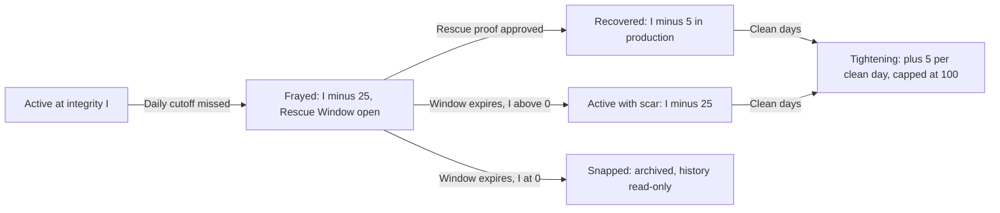

# KNOT: Problem-Solution Thesis (problem-solution.md)

> **Document Status:** Flagship Submission Rationale (Behavioral Science & Product Strategy)
> **Target Event:** App Builders Hackathon
> **Source Documents:** `project-kickstart.md`, `00-context.md`, `01-scope.md`, `02-hypotheses.md`, `03-loop.md`, `mvp-spec.md`
> **Scope:** Why KNOT is necessary, which problems it solves, which mechanics solve them, and which peer-reviewed literature justifies each mechanic.
> **Evidence Standard:** Every behavioral claim is graded. Where the science is contested, the contest is stated. Where KNOT's effect is unproven, it is labeled as a hypothesis under validation in `mvp-spec.md` Section 7.

---

## 0. Reading Conventions

### 0.1 Evidence Grades

| Grade | Definition |
| :---: | :--- |
| **A** | Meta-analytic support or multi-lab replication; direction and approximate magnitude are stable. |
| **B** | Multiple independent peer-reviewed studies with consistent direction; magnitude varies by context. |
| **C** | Single study, small samples, theoretical model, or a finding with documented replication or interpretive disputes. |
| **D** | Practitioner concept, industry testimony, journalism, or KNOT internal simulation. No peer-reviewed human evidence. |
| **H** | KNOT-specific hypothesis. The mechanism is grounded in A to C literature, but its effect inside KNOT is unmeasured and scheduled for validation. |

### 0.2 Build-Tier Labels (from `mvp-spec.md` Section 2)

| Label | Meaning |
| :--- | :--- |
| **Tier 1** | Loop Zero. Ships in the hackathon build and appears in the live demo. |
| **Tier 2.x** | Hackathon extension in priority order. Ships only after the Tier 1 demo runs cleanly twice in a row on production. |
| **Tier 3** | Deferred post-hackathon. Represented by a schema guard or a text fallback only. |
| **Tier 0** | Enabling infrastructure required by Tier 1 (auth, invite links, discovery rules, PWA shell). |

---

## 1. The Modern Context: The Attention Economy and Hyper-Isolation

### 1.1 Attention as the Scarce Resource

<mark style="background: #FF5582A6;">Herbert Simon stated the governing constraint of the information age in 1971</mark>: *"a wealth of information creates a poverty of attention"* (Simon, 1971). Platforms whose revenue scales with time-on-device compete for that scarce attention. Their optimization target is **engagement**, not the user's stated goals. The two diverge measurably.

- In a randomized field experiment with roughly 2,000 U.S. adults, Allcott, Gentzkow, and Song (2022) estimated that **self-control problems account for approximately 31% of social media use**. That is, users would use these platforms about one-third less if they could commit in advance to their own preferred limits. The same study found evidence that social media use is habit-forming, because temporary incentives to reduce use produced persistent reductions after the incentives ended. **[Grade B]**
- In a separate randomized experiment, deactivating Facebook for four weeks increased subjective well-being and shifted time toward offline activities, including socializing with friends and family (Allcott, Braghieri, Eichmeyer, & Gentzkow, 2020). **[Grade B]**
- Limiting social media to approximately 10 minutes per platform per day for three weeks reduced loneliness and depressive symptoms relative to controls in an undergraduate sample (Hunt, Marx, Lipson, & Young, 2018). **[Grade C]** (single site, small sample)

The economic finding matters more than any clinical label. Whether or not "social media addiction" is a diagnosable disorder (it is not a DSM-5-TR diagnosis), there is a quantified, demand-side **gap between what users choose in the moment and what they would choose in advance**. In economics, that gap is the exact condition under which a **commitment device** creates value (Bryan, Karlan, & Nelson, 2010; Laibson, 1997). KNOT is designed as a commitment device.

### 1.2 Variable Reward Schedules: Skinnerian Reinforcement in Short-Form Feeds

#### 1.2.1 The Behavioral Mechanism

Ferster and Skinner (1957) catalogued how the *schedule* of reinforcement, rather than its size, shapes behavior. Among the four classic schedules, the **variable-ratio** schedule (reward after an unpredictable number of responses) produces the highest sustained response rates and the greatest resistance to extinction. This is the operating principle of the slot machine. Schüll (2012) documented in ethnographic detail how modern machine gambling is engineered around continuous, rapid, unpredictable reinforcement to sustain what players call "the zone." **[Grade A for schedule effects in animal and human operant research; Grade B for the ethnographic account]**

#### 1.2.2 The Neural Mechanism

- Midbrain dopamine neurons encode **reward prediction error**: the difference between the reward received and the reward expected (Schultz, Dayan, & Montague, 1997). **[Grade A]**
- Dopamine neurons also show sustained activation that scales with **reward uncertainty** and peaks when reward probability is near 50% (Fiorillo, Tobler, & Schultz, 2003). Uncertainty itself is motivationally potent. **[Grade B]**
- Dopamine is more closely tied to **incentive salience ("wanting")** than to hedonic pleasure ("liking") (Berridge & Robinson, 1998). This explains a common user report: compulsive continuation of an activity that is no longer enjoyable. **[Grade B]**
- In an fMRI study, viewing personalized TikTok (Douyin) recommendations produced higher activation in the **ventral tegmental area** and default mode network subregions than viewing non-personalized videos (Su et al., 2021). **[Grade C]** (single study, one platform, one cultural sample)

#### 1.2.3 Feed Mechanics Mapped to Reinforcement Principles

| Feed Mechanic | Reinforcement Analog | Mechanism of Capture | Evidence |
| :--- | :--- | :--- | :---: |
| Algorithmic short-form video ranking | Variable-ratio schedule | Each swipe is a low-cost "pull" with an unpredictable payoff. Uncertainty sustains dopaminergic "wanting." | B (mechanism), C (platform-specific neural data) |
| Infinite scroll and autoplay | Removal of stopping cues | No natural endpoint forces an active decision to stop instead of a passive one. | D (design analysis) |
| Pull-to-refresh | Slot-machine lever | Its inventor, Loren Brichter, publicly acknowledged the slot-machine parallel (Lewis, 2017). | D (journalism) |
| Push notifications and badges | Variable-interval schedule plus external cue | A notification that is received but not opened still degrades attention on a concurrent task (Stothart, Mitchum, & Yehnert, 2015). | B |
| Likes and view counts | Intermittent social reinforcement | Social approval arrives on an unpredictable schedule and amount. | B (mechanism) |
| Chat streak counters | Loss-aversion lock-in | Losses loom larger than equivalent gains (Kahneman & Tversky, 1979), so users return to avoid losing the counter rather than to gain anything. | A (loss aversion) |

#### 1.2.4 Calibration Note

The popular "dopamine hijacking" narrative overstates the case. Population-level associations between digital technology use and adolescent well-being are small; in one specification-curve analysis they explained at most about 0.4% of the variance in well-being (Orben & Przybylski, 2019). **[Grade B]** KNOT's thesis therefore does **not** depend on the claim that feeds cause mental illness. It depends on two narrower, better-supported claims:

1. Feeds are deliberately built around reinforcement schedules that maximize continuation **[Grade A/B]**.
2. Users exhibit a measurable self-control gap relative to their own preferences **[Grade B]** (Allcott et al., 2022).

### 1.3 Performative Productivity and Low-Stakes Streaks Versus Meaningful Development

#### 1.3.1 Low-Stakes Streaks

Snapchat streaks count consecutive days on which two users exchange Snaps. When a streak is about to expire, an hourglass appears beside it. TikTok has introduced comparable direct-message streak indicators. The required action is trivial (a single photo of a ceiling satisfies the rule). The motivating force is not the value of the action. It is **loss aversion** applied to an accumulated counter (Kahneman & Tversky, 1979).

Silverman and Barasch (2023), in the *Journal of Consumer Research*, demonstrated across multiple studies that consumers are more likely to continue a behavior when an intact streak is highlighted, and **less likely to continue once they learn the streak is broken**. Critically, the effect was driven by how the behavior was **represented** in the log (on track versus off track), independent of the actual volume of behavior performed. **[Grade B]** The representation, not the reality, governs persistence. This finding is the single most direct empirical justification for KNOT's integrity meter (Section 3.1).

#### 1.3.2 Performative Productivity ("Larping")

Performative productivity is the display of the *aesthetics* of effort without its output: curated desk setups, "study with me" thumbnails, unopened planners, and gym selfies that substitute for training logs. Goffman (1959) described social life as front-stage performance. Digital platforms reward the front stage and make the back stage invisible. Three documented mechanisms make performance a substitute for work instead of a precursor to it:

| Mechanism | Finding | Implication | Evidence |
| :--- | :--- | :--- | :---: |
| **Symbolic self-completion** | When identity-relevant intentions were noticed by others, participants subsequently invested **less** effort in acting on them, as if the social acknowledgement partially completed the identity goal (Gollwitzer, Sheeran, Michalski, & Seifert, 2009). | Broadcasting an aspirational identity can satisfy the need that was supposed to motivate the work. | C |
| **Goal licensing** | Perceived progress toward a goal can license goal-inconsistent choices afterward (Fishbach & Dhar, 2005). | An aesthetic setup creates the *feeling* of progress and licenses not doing the task. | B |
| **Goodhart's and Campbell's laws** | When a measure becomes a target, it ceases to be a good measure (Goodhart, 1984); quantitative indicators used for decisions become subject to corruption pressures (Campbell, 1979). | Any self-reported habit metric invites gaming once it carries social reward. | B (widely documented across domains) |

#### 1.3.3 Comparison Matrix

| Dimension | Low-Stakes Chat Streak | Performative Productivity | Meaningful Development (KNOT Target) |
| :--- | :--- | :--- | :--- |
| Unit of action | One message or photo of anything | A curated image or post about effort | A verified instance of the committed behavior |
| Effort cost | Near zero | Low (staging) | Substantive (the work itself) |
| Verification | None | None; often actively misleading | Live capture plus peer audit |
| Audience | One contact or a broadcast follower graph | Broadcast follower graph | One accountable partner |
| Consequence of failure | Total counter reset | None | Partial, recoverable integrity loss |
| What is reinforced | Returning to the app | Appearing productive | Doing the committed behavior |
| Long-run outcome | Platform engagement | Identity signaling without output | Accumulated real output and skill |

### 1.4 The Paradox of Modern Connectivity: Hyper-Connected, Yet Isolated in Discipline

#### 1.4.1 The Isolation Trend

- The 2023 U.S. Surgeon General's Advisory, *Our Epidemic of Loneliness and Isolation*, citing American Time Use Survey analyses, reports that daily in-person time with friends among Americans fell from roughly **60 minutes in 2003 to 20 minutes in 2020**, a trend that predates the COVID-19 pandemic (U.S. Office of the Surgeon General, 2023). **[Grade B]**
- U.S. adolescents' in-person peer interaction declined across the 2000s and 2010s, and the decline was associated with loneliness (Twenge, Spitzberg, & Campbell, 2019). **[Grade B]** (correlational)
- Young adults in the highest quartile of social media use had approximately twice the odds of perceived social isolation compared with the lowest quartile (Primack et al., 2017). **[Grade B]** (cross-sectional; direction of causality unresolved)
- Stronger social relationships are associated with a 50% increase in the likelihood of survival across a meta-analysis of 148 studies (Holt-Lunstad, Smith, & Layton, 2010). **[Grade A]**

Turkle (2011) named the resulting condition *Alone Together*: constant digital contact that does not deliver the substance of relationship.

#### 1.4.2 The Accountability Gap

Modern networks are optimized for **broadcast** (one-to-many, low-stakes, asynchronous display) rather than **commitment** (one-to-one, consequential, reciprocal obligation). The difference matters for behavior change:

- Granovetter (1973) showed that weak ties are efficient carriers of *information*. Information transfer is what broadcast networks scale.
- Centola (2010) showed experimentally that health *behavior* spread farther and faster through **clustered networks with redundant, reinforcing ties** than through random networks with greater reach. **[Grade B]** Behavior change requires reinforcement from close, repeated contacts, not exposure to many distant ones.

The result is a structural gap. A person can have hundreds of contacts and still pursue every personal goal **unwitnessed**. The workout, the study block, and the outreach call happen alone, with no one who notices when they stop. Discipline has been privatized while attention has been socialized. KNOT is designed to reverse that allocation: **make discipline social and make attention private.**

### 1.5 Design Thesis: KNOT as an Inversion of the Attention Economy

| Attention Economy Property | KNOT Inversion | Implementing Mechanic |
| :--- | :--- | :--- |
| Infinite, algorithmically ranked content | Finite content: only proofs from active knot partners | Search-only and invite-only discovery; no explore feed (Tier 0) |
| Variable, unearned reward | Outcome tied to a fixed, earned action | Daily check-in, Silent Pass, Tightening Bonus (Tier 1) |
| Broadcast to weak ties | Dyadic commitment to one strong tie | Tied Knot (Tier 1) |
| Unverified display of effort | Verified capture of action | Live `getUserMedia()` capture and Bluff Calls (Tier 1) |
| Binary punishment that drives abandonment | Graded, recoverable consequence | 25% Fray and 24h Rescue Window (Tier 1) |
| Engagement maximization (stay longer) | Completion and exit (check in, then leave) | Bounded session design; Focus Lockout (Tier 2.4) |
| Cloud-dependent AI verification | On-device Local AI pre-audit | WebGPU/WASM vision + embeddings; zero raw bytes leave silicon (Tier 1) |

### 1.6 The Local AI Imperative & Philippine Infrastructure Reality

KNOT is architected as a **Local AI system**: on-device compute via WebGPU/WASM that remains fully useful when the cloud disappears and preserves privacy by construction. This is not a demographic localization. The Philippine operating environment — prepaid mobile data caps, MRT/LRT and provincial-road dead zones, brownout-induced backhaul loss — is the primary real-world proof that cloud-reliant habit infrastructure fails at the moment of need. A check-in that requires a round-trip to `us-east-1` is a check-in that does not happen on the 18:00 MRT, on a capped prepaid load, or during a barangay brownout. KNOT therefore verifies proofs and searches journals **on hardware silicon first**, and treats the cloud as an eventual-consistency sync target, not a runtime dependency.

#### 1.6.1 The Privacy Paradox: Intimate Proofs Cannot Leave the Device

Daily habit proofs are intimate by definition: messy bedrooms behind the workout frame, private code screens and OKR dashboards in deep-work proofs, honest workout struggles and body images users will show a chosen partner but will never stream to a vendor model endpoint. Personal journals and reflection notes attached to Blueprints carry the same sensitivity. Centralized AI verification demands exactly what users refuse to give — raw camera feeds and verbatim journals uploaded to third-party inference servers for classification, embedding, and indefinite retention.

KNOT resolves the paradox by keeping both modalities on-device. The **Local Vision Anti-Cheat** model classifies camera frames in-browser (<200ms, WebGPU) and emits only a low-dimensional verdict (`authentic | suspect-blank | suspect-screen | low-signal`) plus a confidence scalar. The **Local RAG & Embeddings** engine (`all-MiniLM-L6-v2`, ONNX Runtime Web / `@huggingface/transformers`) embeds journal text and Blueprint documents into local vectors for private semantic search. Raw pixels and raw prose never traverse the network; only the derived attestation — verdict, embedding hash, timestamp — is eligible for sync. Peer review then operates on the already-filtered proof, preserving the conjunctive social contract (Sections 3.4, 4.4) without expanding the surveillance surface. **[Grade B for privacy-driven adoption friction; Grade H for local-verdict effect on dispute rates inside KNOT]**

#### 1.6.2 The Zero-Cloud Reality (Philippine Context)

Cloud-reliant habit apps exhibit three correlated failure modes under Philippine infrastructure:

1. **Prepaid data economics.** Per-megabyte sensitivity makes every cloud vision call a metered transaction the user pays for. Background re-uploads, model re-queries, and feed prefetch silently consume load. Users respond by disabling data — and the habit loop dies with it.
2. **Transit dead zones.** MRT/LRT tunnels, inter-island routes, and provincial corridors produce deterministic connectivity gaps precisely aligned with commute windows when check-ins (gym, reading, outreach) are captured. A server-gated capture pipeline converts a tunnel into a missed cutoff, an unjust 25% fray, and a what-the-hell trigger (Section 4.1).
3. **Brownouts and backhaul loss.** Grid instability removes both device charging and cell-site backhaul. The habit system must degrade to fully offline operation, not to an error banner.

KNOT's response is an **offline-first Local AI pipeline**. Proof capture → local vision classification → local embedding → **local cryptographic attestation** (device-signed `proof_hash + verdict + client_timestamp + knot_id`, queued in IndexedDB/outbox) all execute with zero network. Blueprint journal search runs against a locally cached vector index. When connectivity returns, the attestation syncs to Supabase, where server-authoritative timestamps (`auto_approve_at`, `rescue_expires_at`) and RLS-gated peer audit resume without re-running inference. The ledger math is unchanged — 25% fray, 80% rescue recovery (100% in demo), +5% tighten — but its *inputs* are now available offline. The knot frays only for genuine inaction, never for infrastructure absence.

#### 1.6.3 Cost & Latency: $0 Sub-Second Inference

Cloud AI verification imposes a per-proof marginal cost (vision API + embedding API + egress) that scales linearly with the exact behavior KNOT seeks to maximize — daily check-ins — plus 800–2500ms of network tail latency on Philippine mobile links before peer review can even begin. That cost-latency product punishes success and breaks the 3-minute demo contract.

On-device WebGPU/WASM inference inverts both terms to zero and sub-second: **$0 marginal cost** (model weights cached in the PWA after first fetch, quantized ONNX, no per-call billing) and **<200ms vision classification / <100ms embedding** on mid-tier mobile silicon, executed in a Web Worker off the main thread. No cold-start, no quota, no data-charge. Server spend collapses to storage + Postgres; inference scales with the user's own hardware, not the project's API budget. For judges this is directly falsifiable: disable Wi-Fi/cellular in DevTools, submit a proof, and observe local verdict, local attestation, and queued sync — no cloud required.

---

## 2. Comprehensive Problem Catalog

Each problem is documented with a definition, its observable signature, its causal mechanism, who bears its cost (personas from `project-kickstart.md` Section 3), and why incumbent designs fail to resolve it.

### 2.1 Problem 1: Streak Death Spirals

| Field | Analysis |
| :--- | :--- |
| **Definition** | Binary streak counters convert a single lapse into total loss of accumulated progress, which frequently triggers full abandonment of the habit. |
| **Observable signature** | Engagement collapses within days of the first broken streak; users who lose long streaks rarely rebuild them; the habit, not just the counter, is abandoned. |
| **Causal mechanism** | (1) The lapse is represented as total failure, and representation drives persistence (Silverman & Barasch, 2023). (2) Once a self-imposed standard is violated, people disinhibit and abandon it entirely, the pattern Cochran and Tesser (1996) labeled the *what-the-hell effect*, first documented as counterregulation in restrained eaters (Herman & Mack, 1975; Polivy & Herman, 1985). (3) Internal, global attributions for a lapse ("I am not a disciplined person") convert a lapse into a relapse (Marlatt & Gordon, 1985). |
| **Who bears the cost** | All personas, most severely sporadic users (`03-loop.md` Archetype B), who are the population a habit product most needs to retain. |
| **Why incumbents fail** | Binary counters are cheap to build and potent for daily retention while intact, so they persist despite the cliff. Patches such as purchasable or earned "streak freezes" and paid streak restoration acknowledge the fragility but preserve the binary representation and often monetize the user's loss aversion. |
| **Countervailing evidence** | In a real-world habit formation study, missing a single opportunity did not materially affect the habit formation process (Lally, van Jaarsveld, Potts, & Wardle, 2010). The **behavioral** cost of one lapse is small; the binary counter makes the **perceived** cost catastrophic. The counter, not the lapse, does the damage. |

### 2.2 Problem 2: Social Loafing and Partner Ghosting

| Field | Analysis |
| :--- | :--- |
| **Definition** | In shared commitments, effort is asymmetric. When one partner disengages, the active partner's shared progress decays through no fault of their own, and the platform offers no exit that preserves their history. |
| **Observable signature** | Activity asymmetry (one member submits three or more times as many proofs as the other over five or more days, `02-hypotheses.md` F10), followed by the active member's disengagement. |
| **Causal mechanism** | (1) **Social loafing**: individuals exert less effort when contributions are pooled and less identifiable (Latané, Williams, & Harkins, 1979; meta-analysis by Karau & Williams, 1993). (2) **The sucker effect**: when people perceive that a partner is free-riding, they reduce their own effort to avoid being exploited (Kerr, 1983). (3) **Sunk-cost entrapment**: users remain in dead commitments because leaving forfeits accumulated history (Arkes & Blumer, 1985). (4) **Absence of exit**: Hirschman (1970) showed that systems without a viable exit option convert dissatisfaction into silent withdrawal rather than constructive action. |
| **Who bears the cost** | Peer duos and small collectives; specifically, the more committed member. |
| **Why incumbents fail** | Shared-streak products tie both members to a single counter with no mechanism to detect or resolve asymmetry. The active user's only options are to keep paying for the partner's absence or to delete the commitment and its history. |
| **KNOT-specific risk** | KNOT's own fray formula applies a penalty for each missing member. Without an exit, a ghosting partner drives a compliant user's knot to a snap by Day 8 (`03-loop.md`, scenario C+A, 100% snap rate across 5,000 simulated runs; **Grade D**, internal simulation). The integrity mechanic **creates** this problem unless the Deadweight Clause resolves it. |

### 2.3 Problem 3: Performative Logging and Cheating

| Field | Analysis |
| :--- | :--- |
| **Definition** | Habit apps that accept self-reported checkmarks or gallery uploads impose no verification cost, so recorded progress carries no credibility for the user, the partner, or the system. |
| **Observable signature** | Near-perfect logged compliance with no corresponding real-world change; reused or staged photos; partners who stop trusting each other's logs. |
| **Causal mechanism** | (1) **Goodhart's law**: once a log is the target, it is gamed (Goodhart, 1984; Campbell, 1979). (2) **Economics of deterrence**: the expected cost of cheating equals detection probability multiplied by sanction (Becker, 1968). With no verification and no reviewer, both terms approach zero. (3) **Cheap signals**: a claim that costs the same to produce whether true or false carries little information (Spence, 1973; Donath, 2007). |
| **Who bears the cost** | Every honest user, because unverifiable logs make their genuine work indistinguishable from fabricated work. |
| **Why incumbents fail** | Verification adds friction, and friction reduces the engagement metrics incumbents optimize. Most habit apps therefore trust self-report entirely. |

### 2.4 Problem 4: Solo Friction and Deep Work Inertia

| Field | Analysis |
| :--- | :--- |
| **Definition** | Starting effortful work alone carries a high psychological activation cost. Without a witness or a pacing partner, present bias wins at the moment of initiation. |
| **Observable signature** | Repeated deferral of high-value tasks; the start of a session, not its continuation, is the dominant failure point. |
| **Causal mechanism** | (1) **Temporal motivation theory**: motivation falls as task delay and personal impulsiveness rise, and procrastination is a robust function of task aversiveness and delayed reward (Steel, 2007). **[Grade A]** (2) **Present bias**: people discount near-term costs and future benefits inconsistently, so a plan made yesterday is overridden today (Laibson, 1997). (3) **Attention residue**: switching from one task to another leaves cognitive residue that impairs performance on the new task (Leroy, 2009). (4) **Absence of social pacing**: the isolation trend (Section 1.4) removes the incidental co-presence that historically paced work. |
| **Who bears the cost** | Solo self-improvers, remote students, and knowledge workers. |
| **Why incumbents fail** | Timers and to-do lists address scheduling, not initiation. They add no social stake to the moment of starting. |

### 2.5 Problem 5: Setup Paralysis

| Field | Analysis |
| :--- | :--- |
| **Definition** | Defining a habit from scratch (title, schedule, cutoff time, proof criteria) imposes cognitive load at the exact moment motivation is most fragile, which delays or prevents the first commitment. |
| **Observable signature** | Abandoned onboarding flows; vague goals ("get fit") that never translate into a concrete, checkable behavior. |
| **Causal mechanism** | (1) **The intention-behavior gap**: intentions account for only about 28% of the variance in subsequent behavior (Sheeran, 2002). **[Grade A]** (2) **Missing implementation intentions**: specifying *when, where, and how* a behavior will occur substantially increases goal attainment (meta-analytic effect size of approximately d = 0.65; Gollwitzer & Sheeran, 2006). **[Grade A]** Blank-slate setup forces users to construct these plans unaided. (3) **Choice overload under preference uncertainty**: the classic demonstration (Iyengar & Lepper, 2000) did not hold up as a universal effect; one meta-analysis found a mean effect near zero (Scheibehenne, Greifeneder, & Todd, 2010). However, a later meta-analysis identified reliable moderators, including **preference uncertainty and decision task difficulty** (Chernev, Böckenholt, & Goodman, 2015). **[Grade B]** Novices designing their first habit protocol sit precisely in the high-uncertainty, high-difficulty condition. (4) **Self-set deadlines underperform**: students who chose their own deadlines performed better than those with no deadlines but worse than those given evenly spaced external deadlines (Ariely & Wertenbroch, 2002). **[Grade B]** |
| **Who bears the cost** | First-time users and judges evaluating the product in under three minutes. |
| **Why incumbents fail** | Products either offer blank forms (high load) or rigid fixed programs (low fit). |

### 2.6 Problem 6: Ambient Digital Distraction

| Field | Analysis |
| :--- | :--- |
| **Definition** | The reflexive, cue-triggered urge to open feed-driven apps fragments attention during committed work, and many productivity apps themselves embed feeds that reproduce the problem. |
| **Observable signature** | Short, frequent, unplanned phone checks; sessions in which the productive action takes seconds but the visit lasts many minutes. |
| **Causal mechanism** | (1) **Checking habits**: smartphone use is dominated by brief, repetitive checking sessions triggered by cues rather than goals (Oulasvirta, Rattenbury, Ma, & Raita, 2012). **[Grade B]** (2) **Habit as cue-response automaticity**: habitual behavior is triggered by context and proceeds largely independent of current goals (Wood & Neal, 2007). **[Grade A]** (3) **Interruption cost**: interrupted workers compensate by working faster but report more stress, frustration, and workload (Mark, Gudith, & Klocke, 2008); information work is highly fragmented into short episodes (Mark, Gonzalez, & Harris, 2005). **[Grade B]** (4) **Notification cost**: merely receiving a notification, without opening it, degrades performance on an attention-demanding task (Stothart et al., 2015). **[Grade B]** |
| **Who bears the cost** | Chronic doomscrollers and anyone attempting deep work. |
| **Why incumbents fail** | Social habit apps add social feeds, likes, and discovery tabs to increase engagement, reintroducing the variable-reward surface that the user was trying to escape. |
| **Platform constraint** | A web application **cannot** lock, close, or block other applications on the user's operating system. This is a browser sandbox boundary, not a design choice (`project-kickstart.md` Findings; `00-context.md` Section 2). KNOT's countermeasures are therefore limited to (a) not being a distraction source itself, (b) in-app lockout, and (c) soft social commitment. |

---

## 3. 1-to-1 Problem-to-Solution Matrix

### 3.1 Master Matrix

| # | Problem | KNOT Mechanic | Primary Behavioral Lever | Key Parameters (`mvp-spec.md` 4.1) | Build Tier | Validation Metric |
| :---: | :--- | :--- | :--- | :--- | :---: | :--- |
| 1 | Streak Death Spirals | 25% Fray Decay and 24h Rescue Window | Lapse is represented as partial and recoverable, blocking the what-the-hell response | Fray 25%; Rescue 24h; recovery ratio 0.80 (production) or 1.00 (demo); Tightening +5% per clean day | Tier 1 | `rescue_completion_rate`, `post_fray_survival`, `post_fray_abandonment` (`mvp-spec.md` 7.1) |
| 2 | Social Loafing and Ghosting | 72h Deadweight Clause ("Sever and Save") | Credible exit that preserves history, neutralizing sunk-cost entrapment and the sucker effect | Inactivity trigger 72h (demo 90s); conversion to Anchor Knot with proof history intact | Tier 2.2 (Tier 1 fallback: inactivity badge plus Untie) | Untie rate and F10 activity asymmetry (`02-hypotheses.md`); no Section 7 metric yet (see 3.8) |
| 3 | Performative Logging and Cheating | Live `getUserMedia()` capture, 2h Silent Pass, Duo Bluff Calls ("Call Larp") | Raises the cost of faking and adds a detection probability with reputational sanction | Zero file inputs in the proof DOM; server-side timestamp; Silent Pass 2h (demo 60s); single-partner dispute | Tier 1 | `gallery_upload_paths`, `partner_review_rate`, `canary_detection_rate`, `proof_outcome_mix`, `post_dispute_resubmit` |
| 4 | Solo Friction and Deep Work Inertia | 1-on-1 Tied Knots and Focus Lockout | Conjunctive interdependence (Köhler effect) at initiation; in-app commitment environment during work | Shared integrity per knot; per-member fray; Focus Lockout with Screen Wake Lock and fullscreen fallback | Tied Knot Tier 1; Focus Lockout Tier 2.4 | `member_checkin_rate`, `knot_survival_d7`, `knot_survival_d14`, `demo_knot_ratio` |
| 5 | Setup Paralysis | lockedIn Blueprints preset registry | Pre-built implementation intentions delivered as defaults | 4 presets pre-filling title, check-in window, proof hint; persisted as `knots.blueprint_slug` | Tier 2.5 (Tier 1 fallback: hardcoded `PRESETS`) | `demo_onboarding_speed` (90s or less to first proof); account-to-knot conversion of 80% or more (`02-hypotheses.md` 3.1) |
| 6 | Ambient Digital Distraction | Search-only and invite-only discovery; zero explore feeds | Removes variable-reward surfaces; restores stopping cues; bounded content | Discovery only by exact username, QR code, or signed invite link; only active-partner proofs visible | Tier 0 | No Section 7 metric yet (see 3.8) |

### 3.2 Mapping 1: Streak Death Spirals to 25% Fray Decay and the 24h Rescue Window

**Mechanism design.** A missed daily cutoff appends a negative delta to the append-only `integrity_events` ledger instead of resetting a counter. Integrity is the clamped sum of deltas (0 to 100). The miss opens a 24-hour Rescue Window, stored as `knots.rescue_expires_at` and evaluated lazily on read. A rescue proof approved inside the window restores 80% of the fray in production, leaving a permanent 5-point scar, or 100% in demo mode. Consecutive clean days add a +5% Tightening Bonus, which allows scars to heal over time. A knot snaps only when integrity reaches 0% **and** no rescue window remains open.

**Parameter rationale.**

| Parameter | Value | Justification |
| :--- | :--- | :--- |
| Fray size | 25% | Large enough to register as a real consequence on the meter; small enough that one miss leaves 75% of equity intact. Derived from the squad-scaled formula `(100% / members) x 0.5`, which evaluates to 25% for a duo and avoids rework when Squad Knots ship (`01-scope.md` Section 6). |
| Rescue window | 24 hours | Long enough to fit inside the next waking day; short enough to preserve urgency and prevent indefinite deferral. Functions as an immediate micro fresh start (Dai, Milkman, & Riis, 2014) instead of forcing the user to wait for a temporal landmark such as Monday. |
| Recovery ratio | 0.80 | A 5-point scar keeps the lapse meaningful. `03-loop.md` reports that full forgiveness encourages sloppy habit formation while 60% recovery produces slow decay (**Grade D**, internal simulation). |
| Tightening bonus | +5% per clean day | Without it, unrescued slips become permanent and Archetype B's simulated snap rate rises to 32.5%; with it, the sporadic-plus-consistent pairing snaps in under 1% of 30-day runs (`03-loop.md` reports 0.1% in its comparison table and 0.4% in its narrative; both values are under 1%). **Grade D.** |

**Failure-mode guards.** Rescue farming (frequent frays with near-100% rescue, `02-hypotheses.md` F7) is monitored, with diminishing rescue returns as the documented response. Unseen rescue windows (F5) are distinguished from ignored ones (F6) by the `rescue_banner_viewed` event.

### 3.3 Mapping 2: Ghosting to the 72h Deadweight Clause ("Sever and Save")

**Mechanism design.** Each member's `knot_members.last_active_at` is compared against the 72-hour threshold. Once exceeded, the active partner may invoke Sever and Save, a single transactional conversion of the Tied Knot into a solo Anchor Knot that preserves the full proof history and ledger.

**Parameter rationale.** With a 25% per-member fray, a fully absent partner causes the fourth consecutive miss to reach 0% (`mvp-spec.md` 4.1: "4 days to total snap"). The 72-hour trigger therefore becomes available after three missed cutoffs, **one fray before the knot can snap**. The exit opens at the last point where meaningful equity (approximately 25% absent any rescue or tightening) still exists to be saved.

**Behavioral logic.**

| Threat | How Sever and Save Neutralizes It |
| :--- | :--- |
| Sucker effect (Kerr, 1983) | The active user stops paying for the partner's absence without abandoning their own commitment. |
| Sunk-cost entrapment (Arkes & Blumer, 1985) | History is preserved, so leaving the partnership no longer means forfeiting invested effort. |
| Absence of exit (Hirschman, 1970) | A legitimate exit retains the user inside the product rather than losing them to silent withdrawal. |
| Defection without defense (Axelrod, 1984) | Cooperation is sustainable only when players can respond to sustained defection; Sever and Save is that response. |

**Tier constraint.** Sever and Save is Tier 2.2 and depends on Anchor Knot (Tier 2.1). The Tier 1 build ships the documented fallback: a "Partner inactive: Xd" badge derived from `last_active_at` and an Untie action that archives the knot, stops fraying, and keeps all proofs readable (`01-scope.md` Section 3). History is preserved in Tier 1; only the conversion to a solo track is deferred.

### 3.4 Mapping 3: Cheating to Live Capture, the 2h Silent Pass, and Duo Bluff Calls

**Mechanism design.**

1. **Live capture.** Proofs are captured exclusively through `MediaDevices.getUserMedia()` into an in-DOM `<video>` element, rasterized to a canvas (maximum 1280 px width, JPEG quality 0.70), and submitted in a single atomic request to `/api/proofs/submit`. No `<input type="file">` element exists anywhere in the proof flow, so there is no gallery path on mobile or desktop. Canvas rasterization strips EXIF metadata, including GPS coordinates.
2. **Server-authoritative time.** The proof timestamp is set by PostgreSQL on receipt. Client clocks are disregarded.
3. **Silent Pass.** Each proof stores `auto_approve_at = submission + 2h`. If the partner takes no action, the proof resolves to approved lazily on read (`v_resolved_proofs`). Honest users pay no review friction.
4. **Bluff Call.** Within the window, the partner may "Call Larp." Row Level Security restricts this transition to a non-author member of the same knot, and only from `pending` to `disputed` (`mvp-spec.md` Section 3). A disputed proof earns no integrity credit; the author may retake it before the cutoff or within the Rescue Window.
5. **Local AI pre-audit (Tier 1, on-device).** Before upload, a WebGPU/WASM vision model classifies the live frame locally (<200ms, Web Worker) as `authentic | suspect-blank | suspect-screen | low-signal` and surfaces an instant, private nudge ("Ceiling detected — retake?"). No raw pixels leave the device; only the verdict scalar joins the submission attestation. Peer audit remains authoritative — Local AI filters obvious larps at zero data cost, it does not auto-reject.

**Behavioral logic.** Live capture does not make honest proofs expensive. It makes **dishonest proofs expensive**: a reused gallery photo becomes impossible, and faking now requires staging a fresh scene in real time. The Bluff Call adds a non-zero detection probability with a reputational sanction delivered by the one person whose opinion the user has chosen to make consequential. Under Becker's (1968) framework, both terms of expected cheating cost rise above zero.

**Platform honesty.** No browser sandbox can determine whether a camera is pointed at a real scene or at a screen displaying an old photo, and virtual-camera software can impersonate hardware on desktop (`04-pwa.md` Section 1.4). Live capture raises the cost of cheating; it does not eliminate cheating. Peer audit is the second, social defense layer.

**Validation design.** Bluff-call rate alone cannot distinguish honest users from inattentive partners (`02-hypotheses.md` F3). The **canary proof** protocol supplies ground truth: during beta days 8 to 14, consenting testers submit one deliberately low-effort proof at an unannounced time, and the detection rate (target 50% or more) measures partner vigilance directly.

### 3.5 Mapping 4: Deep Work Inertia to 1-on-1 Tied Knots and Focus Lockout

**Mechanism design.**

- **Tied Knot (Tier 1).** Two members share one integrity meter. Each member's missed cutoff frays the shared knot, and the Tightening Bonus requires **both** members to have approved proofs on the same day. This is a **conjunctive** structure: the knot's outcome depends on the weaker member's contribution.
- **Synthetic partner (Tier 1).** Users without a partner can tie a knot with `@knot-demo`, a disclosed system account that auto-accepts invites and submits daily proofs. This removes the cold-start dead end for solo users and solo judges.
- **Focus Lockout (Tier 2.4).** A full-viewport in-app timer that requests a Screen Wake Lock to prevent device sleep. It uses the Fullscreen API where supported and falls back to a CSS viewport lock on iPhone, where WebKit does not support the Fullscreen API on generic DOM elements. Tab switches are detected through `visibilitychange` and logged as breaches.

**Behavioral logic.** The Köhler effect (Section 4.2) predicts that the less consistent member works harder when their contribution is indispensable to a shared outcome. The Tied Knot converts the hardest moment, initiation, into an obligation to a specific person rather than an abstract intention. Focus Lockout supplies a commitment environment for the work session itself.

**Platform honesty.** Focus Lockout restricts navigation **within KNOT only**. It cannot stop a user from opening another app. Its function is a soft commitment ritual plus breach logging, not enforcement. Live synchronous co-working (Live Pomodoro) is deferred to Tier 3 because realtime synchronization is the most likely cause of live-demo failure (`01-scope.md` Section 2).

### 3.6 Mapping 5: Setup Paralysis to the lockedIn Blueprints Preset Registry

**Mechanism design.** Blueprints are protocol templates that pre-define the title, check-in window, and proof criteria. Tier 1 ships four hardcoded presets (*Morning Gym Protocol*, *2-Hour Deep Work Block*, *Daily Reading*, *Side-Hustle Outreach*). The selection is persisted as `knots.blueprint_slug`, so migrating to a forkable `blueprints` table in Tier 2.5 is a backfill, not a schema change.

**Behavioral logic.**

| Lever | How Blueprints Apply It |
| :--- | :--- |
| Implementation intentions (Gollwitzer, 1999; Gollwitzer & Sheeran, 2006) | Each preset encodes *when* (check-in window), *what* (behavior), and *how verified* (proof hint), the components of an if-then plan. |
| Defaults (Thaler & Sunstein, 2008; Jachimowicz, Duncan, Weber, & Johnson, 2019) | A pre-filled, editable protocol becomes the path of least resistance. Meta-analytic evidence shows default effects are robust but vary in size by domain. |
| External deadlines (Ariely & Wertenbroch, 2002) | Presets impose a fixed daily cutoff instead of asking the user to set their own. |
| Reduced preference uncertainty (Chernev et al., 2015) | A small curated set of four protocols replaces an open-ended design task. |

**Discovery model.** When Blueprints become forkable, discovery centers on **protocols** ("most-forked study routines"), never on personal profiles. Users discover methods, not influencers (`project-kickstart.md`, Anti-Doomscroll resolution).

### 3.7 Mapping 6: Distraction to Search-Only Discovery and Zero Explore Feeds

**Mechanism design.** Users can be found only by exact username search, direct QR code, or signed invite link. There is no explore tab, trending page, follower graph, or algorithmic feed. The only stream a user sees contains proofs from people with whom they share an active knot. Row Level Security enforces this boundary at the database layer: knots and proofs are readable only by verified knot members, and invite resolution is served through a security-definer RPC (`get_knot_by_invite`) rather than by exposing pending knots (`mvp-spec.md` Section 3).

**Behavioral logic.**

| Attention-Economy Mechanic | KNOT Countermeasure |
| :--- | :--- |
| Variable-ratio content surface | None exists. The content set is finite and predictable: a handful of partner proofs. |
| Removed stopping cues | Natural stopping point: once the check-in is done and pending reviews are cleared, there is nothing left to consume. |
| Discovery-driven novelty | Discovery requires prior real-world intent (a known username, a shared QR code, a received link). |
| Engagement as success metric | KNOT's success metrics are check-in rate, review rate, and rescue rate, none of which reward longer sessions. |

**Platform honesty.** This mechanic ensures KNOT does not **add** to ambient distraction. It does not **remove** distraction caused by other apps. That limit is a property of the browser sandbox and is stated openly to judges.

### 3.8 Validation Coverage Gaps

Two problem mappings lack a dedicated metric in `mvp-spec.md` Section 7. The following candidate metrics are **proposed, not yet adopted**:

| Problem | Proposed Metric | Definition | Tier |
| :--- | :--- | :--- | :---: |
| 2. Ghosting | `deadweight_trigger_rate` | Knots in which one member crosses the 72h inactivity threshold, divided by all active knots | 2.2 |
| 2. Ghosting | `post_sever_retention_d7` | Users who invoked Sever and Save and remain active 7 days later | 2.2 |
| 6. Distraction | `median_session_seconds` | Median foreground session length; lower values combined with stable check-in rate indicate purposeful, bounded use | 0 |
| 6. Distraction | `post_action_exit_rate` | Sessions that end within 60 seconds after the last required action (check-in or review) | 0 |

---

## 4. Scientific and Theoretical Grounding

Each subsection states the primary sources, the core finding, the mechanism, its application to KNOT, the resulting design implications, and the boundary conditions under which the finding weakens.

### 4.1 The What-the-Hell Effect and Goal Disengagement

**Primary sources.** Herman and Mack (1975); Polivy and Herman (1985); Cochran and Tesser (1996); Marlatt and Gordon (1985); Silverman and Barasch (2023); Soman and Cheema (2004).

**Attribution note.** `project-kickstart.md` attributes the *What-the-Hell effect* to Polivy and Herman (1985). More precisely, Herman and Polivy documented the underlying phenomenon (counterregulation, or disinhibited eating after a perceived diet violation), while Cochran and Tesser (1996) coined the label. Both are cited here.

**Core findings.**

1. In the classic preload paradigm, restrained eaters who believed they had already broken their diet subsequently ate **more**, not less (Herman & Mack, 1975). Polivy and Herman (1985) framed dieting itself as a causal contributor to binging through this all-or-nothing mechanism. **[Grade B]**
2. Cochran and Tesser (1996) showed that goal framing and goal proximity determine whether a setback produces disengagement. Rigid short-term standards make a single violation feel like total failure. **[Grade C]** (book chapter)
3. Violating a specific behavioral goal can depress subsequent goal-directed performance (Soman & Cheema, 2004). **[Grade C]**
4. Marlatt and Gordon (1985) distinguished a **lapse** (a single slip) from a **relapse** (return to the prior pattern). The **abstinence violation effect** converts the former into the latter when the lapse is attributed to internal, stable, and global causes. Relapse prevention therefore treats lapses as expected, bounded events with a planned recovery response. **[Grade B]** (foundational clinical model with broad applied use)
5. Broken-streak awareness reduces continuation, independent of the actual amount of behavior performed (Silverman & Barasch, 2023). **[Grade B]**

**Mechanism.** Binary trackers make every lapse a total failure in representation. The representation triggers abstinence-violation attributions ("I failed") and the what-the-hell response ("it no longer matters").

**Application to KNOT.**

| Science | KNOT Design Decision |
| :--- | :--- |
| Representation drives persistence | The integrity meter never shows "zero" after a single miss. It shows 75%, which is "frayed but holding." |
| Lapse versus relapse | A miss is encoded as a fray (lapse), not a snap (relapse). A snap requires sustained disengagement: integrity at 0% **and** no open rescue window. |
| Planned recovery response | The Rescue Window is a pre-built recovery protocol with a concrete action (one live snapshot) and a deadline. |
| Avoid global attributions | Interface copy frames the fray as an event on the knot ("the knot frayed"), not a verdict on the person. |

**Boundary conditions.** The original counterregulation work concerns restrained eating in laboratory settings; extrapolation to digital habit tracking is by mechanistic analogy, supported most directly by Silverman and Barasch (2023). Whether partial decay outperforms binary reset **inside KNOT** is hypothesis H3, falsified if post-fray abandonment exceeds 50% (`02-hypotheses.md`). **[Grade H]**

### 4.2 The Köhler Effect and Conjunctive Tasks

**Primary sources.** Köhler (1926); Hertel, Kerr, and Messé (2000); Kerr, Messé, Seok, Sambolec, Lount, and Park (2007); Feltz, Kerr, and Irwin (2011); Karau and Williams (1993).

**Core findings.**

1. Köhler (1926) had members of a rowing club hold a weighted bar as long as possible, individually and in groups. In conjunctive groups, where the group's performance ended when the first member quit, groups persisted **longer** than predicted from the weaker member's individual performance, particularly when ability discrepancy was moderate. **[Grade B]** (historical; later replicated)
2. Hertel et al. (2000) replicated the motivation gain under controlled conditions and identified two drivers: upward **social comparison** with a more capable partner, and perceived **indispensability** of one's own contribution to the shared outcome. **[Grade B]**
3. Kerr et al. (2007) tested the mechanisms and found that both social comparison and indispensability contribute. **[Grade B]**
4. Feltz et al. (2011) applied the paradigm to exercise games. Participants paired with a moderately superior virtual partner under conjunctive rules persisted longer at exercise than those exercising alone. **[Grade B]**
5. The opposite outcome, social loafing, dominates when contributions are pooled additively, unidentifiable, and dispensable (Karau & Williams, 1993). Identifiability of individual contribution reduces loafing (Williams, Harkins, & Latané, 1981; Harkins & Jackson, 1985). **[Grade A]**

**Mechanism.** In a conjunctive task, the weaker member cannot hide; the outcome visibly depends on them. Indispensability converts the group from a hiding place into a source of obligation.

**Application to KNOT.**

| Köhler Condition | KNOT Implementation |
| :--- | :--- |
| Conjunctive outcome | Each member's missed cutoff frays the shared knot. The Tightening Bonus requires both members to check in on the same day. |
| Identifiable contribution | Every proof is attributed to one member, timestamped, and visible to the partner. No pooled, anonymous contribution exists. |
| Indispensability | In a duo, each member's contribution is necessary by construction. This is the strongest possible indispensability condition. |
| Moderate ability discrepancy | Blueprints standardize the protocol, which keeps partners on comparable tasks and avoids discrepancies too large to motivate. |
| Synthetic partner | Feltz et al. (2011) found Köhler gains with a virtual partner, which supports `@knot-demo` as a viable fallback. |

**Boundary conditions.** Köhler gains accrue mainly to the **less capable** member and diminish when the discrepancy is very large or very small. In Feltz et al. (2011) participants believed the partner was a real person; `@knot-demo` is disclosed as a bot, which may weaken the effect. The fallback is monitored by red flag F12: if more than 50% of tester knots are with `@knot-demo`, the social premise is not being adopted. Conjunctive structures also create the ghosting vulnerability addressed in Section 3.3. **[Grade B for the effect; Grade H inside KNOT]**

### 4.3 Precommitment and Soft Commitment Devices

**Primary sources.** Schelling (1960, 1984); Bryan, Karlan, and Nelson (2010); Laibson (1997); Ariely and Wertenbroch (2002); Giné, Karlan, and Zinman (2010); Allcott et al. (2022).

**Core findings.**

1. Schelling (1960) showed that voluntarily restricting one's own future options can strengthen one's position by making commitments credible. He later extended the logic to self-command, framing self-control as a contest between present and future selves (Schelling, 1984). **[Grade A as foundational theory]**
2. Quasi-hyperbolic discounting formalizes why plans made in advance are overridden in the moment and why sophisticated agents value commitment (Laibson, 1997). **[Grade A]**
3. Bryan et al. (2010) define a commitment device as an arrangement entered now that restricts or penalizes future choices, and distinguish **hard** commitments (financial or physical penalties) from **soft** commitments (psychological or social costs). **[Grade A]** (Annual Review synthesis)
4. A voluntary financial commitment contract for smoking cessation increased biochemically verified abstinence, but only a minority of those offered the contract took it up (Giné et al., 2010). **[Grade B]** Hard commitments work for those who adopt them, but adoption is limited.
5. Users demonstrate measurable demand for commitment against their own social media use (Allcott et al., 2022). **[Grade B]**

**Mechanism.** Present bias makes the future self's goals lose to the present self's impulses. A commitment device, entered while the long-run self is in control, raises the cost of future defection.

**Application to KNOT.**

| Commitment Property | KNOT Implementation |
| :--- | :--- |
| Entered voluntarily in advance | The user ties a knot and accepts a daily cutoff before the moment of temptation. |
| Raises the cost of defection | Defection frays a meter the partner can see; the cost is social and reputational. |
| Soft rather than hard | No money is staked. This deliberately trades some potency for higher adoption, the documented weakness of hard devices. |
| Credible | The cutoff, fray, and Silent Pass are enforced by server-side timestamps and database rules, not by the user's self-report. |
| Graduated penalty | The fray-and-rescue structure keeps the penalty proportionate, so the device punishes defection without destroying the commitment. |

**Boundary conditions.** Soft commitments are weaker than hard ones for highly present-biased users. Commitment devices help only "sophisticated" users who anticipate their own self-control problems. KNOT's effectiveness as a commitment device is measured by D7 and D14 knot survival and member check-in rate. **[Grade A for theory; Grade H inside KNOT]**

### 4.4 Honest Signaling Theory and Verification Friction

**Primary sources.** Zahavi (1975); Grafen (1990); Penn and Számadó (2020); Spence (1973); Donath (2007); Becker (1968); Lerner and Tetlock (1999).

**Core findings.**

1. Zahavi (1975) proposed the **handicap principle**: signals are reliable when they are costly, because only high-quality signalers can afford the cost. **[Grade C]** (see item 3)
2. Grafen (1990) produced formal models widely interpreted as validating the handicap principle. **[Grade B]**
3. Penn and Számadó (2020) argue that the handicap principle, as commonly stated, is erroneous: signal honesty is better explained by **trade-offs and differential costs**, and honest signals need not be wasteful. **[Grade B]** (major critical review)
4. In economics, Spence (1973) showed that signals separate types when they are **differentially costly**, cheaper for the honest type than for the dishonest type. **[Grade A]**
5. Donath (2007) applied signaling theory to online identity, distinguishing cheap **conventional signals** (claims) from reliable **assessment signals** (displays inherently tied to the quality signaled). **[Grade B]**
6. Becker (1968) modeled the expected cost of rule-breaking as detection probability multiplied by sanction. **[Grade A]** (foundational economic model)
7. Being accountable to an audience whose views are known and who will evaluate one's actions changes behavior and judgment, with effects depending on audience characteristics (Lerner & Tetlock, 1999). **[Grade A]** (review)

**Theoretical position.** KNOT does **not** rely on the strict Zahavian claim that honest proofs must be wasteful. It relies on the better-supported **differential-cost** formulation: a live snapshot of a real workout costs the honest user a few seconds, while producing a convincing fake in real time costs the dishonest user substantially more. That asymmetry, not waste, is what makes the signal informative.

**Application to KNOT.**

| Signaling Principle | KNOT Implementation |
| :--- | :--- |
| Differential cost (Spence, 1973) | Live capture is nearly free for honest users and expensive for fakers, because gallery reuse is structurally impossible. |
| Conventional versus assessment signals (Donath, 2007) | A checkbox is a conventional signal. A live, server-timestamped snapshot moves the proof toward an assessment signal. |
| Detection probability (Becker, 1968) | The 2-hour review window gives the partner a real chance to inspect each proof. |
| Sanction | A Bluff Call denies integrity credit and carries reputational cost with the one person the user chose to be accountable to. |
| Accountability to a known audience (Lerner & Tetlock, 1999) | The reviewer is a specific, chosen partner, not an anonymous crowd. |

**Boundary conditions.** Partner review rate depends on app-open frequency. Without push notifications, `03-loop.md` Section 3 models the 2-hour window reaching the 60% review target only if partners open the app about once every two hours; at one open every four hours, the modeled review rate is 37%, below the 40% kill threshold. This is a known tension between the Silent Pass duration and the in-app-only notification constraint, and it is the primary risk to hypothesis H1. **[Grade H]**

### 4.5 Social Facilitation and Body Doubling

**Primary sources.** Triplett (1898); Zajonc (1965); Cottrell, Wack, Sekerak, and Rittle (1968); Bond and Titus (1983); Carron, Hausenblas, and Mack (1996).

**Core findings.**

1. Triplett (1898) observed that cyclists rode faster when racing against others than when riding alone, one of the first experiments in social psychology. **[Grade C]** (historical)
2. Zajonc (1965) reconciled conflicting results with drive theory: the presence of others increases arousal, which strengthens **dominant responses**. Performance improves on simple or well-learned tasks and deteriorates on complex or novel tasks. **[Grade B]**
3. Cottrell et al. (1968) found that facilitation depended substantially on **evaluation apprehension**; the mere presence of non-evaluating others produced weaker effects. **[Grade C]**
4. A meta-analysis of 241 studies found that the presence of others slightly speeds simple performance and impairs complex performance, and that presence explains a small share of performance variance overall (Bond & Titus, 1983). **[Grade A]**
5. A meta-analysis of social influence on exercise found positive effects of family, important others, and group cohesion on exercise behavior and adherence (Carron et al., 1996). **[Grade A]**
6. **Body doubling**, working alongside another person to reduce task avoidance, originates in ADHD coaching practice. It has **limited peer-reviewed experimental evidence** at the time of writing. **[Grade D]**

**Application to KNOT.**

| Science | KNOT Design Decision |
| :--- | :--- |
| Facilitation helps simple, well-learned behaviors | Daily habits such as gym attendance, reading, and outreach are largely well-learned once established, the condition under which social presence helps. |
| Live observation can impair complex work | KNOT does **not** stream or surveil the work. Verification is a single proof of completion, so deep work is performed without an audience. |
| Evaluation apprehension is a lever | Evaluation is concentrated at the proof, within a 2-hour review window, not continuous during the task. |
| Psychological co-presence without surveillance | The Tied Knot provides a felt partner during the task (shared stakes) without a watching partner (no live feed). |
| Solo session support | Focus Lockout (Tier 2.4) supplies a dedicated environment for complex work without social observation. |

**Boundary conditions.** Body doubling is presented in this document as a practitioner concept, not an established finding. Synchronous co-working, the feature most dependent on it (Live Pomodoro), is deferred to Tier 3 for both technical and evidentiary reasons. **[Grade A for facilitation; Grade D for body doubling]**

### 4.6 Self-Compassion and Resilient Goal Pursuit

**Primary sources.** Neff (2003a, 2003b); Breines and Chen (2012); Adams and Leary (2007); Duckworth, Peterson, Matthews, and Kelly (2007); Credé, Tynan, and Harms (2017); Lally et al. (2010).

**Core findings.**

1. Neff (2003a) defined self-compassion as three components: **self-kindness** versus self-judgment, **common humanity** versus isolation, and **mindfulness** versus over-identification. Neff (2003b) developed and validated the Self-Compassion Scale. **[Grade B]**
2. Self-compassion is not complacency. After a failure on a test, participants induced to be self-compassionate studied **longer** for a retest than those in a self-esteem or control condition (Breines & Chen, 2012). **[Grade B]**
3. Adams and Leary (2007) directly connected self-compassion to the what-the-hell effect. Restrictive and guilty eaters induced to be self-compassionate after an unhealthy preload did **not** show the disinhibited eating observed in controls. **[Grade C]** (single study, but it bridges Sections 4.1 and 4.6)
4. Grit, defined as perseverance and passion for long-term goals, predicted achievement outcomes across several samples (Duckworth et al., 2007). **[Grade B]**
5. A meta-analysis found that grit is strongly correlated with conscientiousness and that its predictive validity is modest; the perseverance facet carries most of the predictive power (Credé et al., 2017). **[Grade A]**
6. Habit automaticity develops over a median of approximately 66 days (range 18 to 254), and a single missed opportunity did not materially affect the process (Lally et al., 2010). **[Grade B]**

**Mechanism.** Harsh self-judgment after a lapse produces shame, and shame motivates avoidance of the domain that caused it. Self-compassion lowers the threat of the failure, which keeps the person engaged long enough to repair it. Perseverance, the most predictive facet of grit, is the behavioral output of that repair process.

**Application to KNOT.**

| Science | KNOT Design Decision |
| :--- | :--- |
| Self-kindness (Neff, 2003a) | The Rescue Window is an operationalized second chance; recovery is built into the system rather than requested as an exception. |
| Mindfulness versus over-identification | The 5-point scar acknowledges the lapse accurately without letting it define the knot. |
| Common humanity | The knot is shared. Lapses are visible to a partner who faces the same mechanics, which normalizes them. |
| Lapses do not derail habits (Lally et al., 2010) | Partial decay aligns the system's consequence with the actual behavioral cost of a single miss. |
| Perseverance (Duckworth et al., 2007; Credé et al., 2017) | The product rewards recovery after failure (rescue, tightening), the facet of grit with the strongest predictive evidence. |
| Avoid shame spirals (`02-hypotheses.md` F4) | Disputed proofs show an immediate "Retake" action and neutral copy, not a punitive verdict. |

**Boundary conditions.** Self-compassion interventions vary in strength and durability. Grit's incremental validity beyond conscientiousness is limited, so KNOT does not claim to build grit as a trait. It claims to design a system in which perseverance after failure is mechanically possible and rewarded. **[Grade B for self-compassion; Grade H inside KNOT]**

### 4.7 Supplementary Grounding for Problems 2, 5, and 6

The six requested theory clusters do not fully cover ghosting, setup paralysis, and ambient distraction. The following literature closes those gaps.

| Problem | Supporting Literature | Core Finding | Evidence |
| :--- | :--- | :--- | :---: |
| 2. Ghosting | Latané et al. (1979); Karau and Williams (1993) | Individuals exert less effort when contributions are pooled and unidentifiable. | A |
| 2. Ghosting | Kerr (1983); Kerr and Bruun (1983) | People reduce effort when they perceive a partner free-riding (sucker effect) or perceive their own effort as dispensable. | B |
| 2. Ghosting | Arkes and Blumer (1985) | Prior investment increases willingness to continue a failing course of action. | B |
| 2. Ghosting | Hirschman (1970); Axelrod (1984) | Viable exit options shape loyalty; cooperation persists only with defenses against defection. | A (theory) |
| 5. Setup Paralysis | Sheeran (2002) | Intentions explain about 28% of the variance in behavior. | A |
| 5. Setup Paralysis | Gollwitzer and Sheeran (2006) | If-then plans improve goal attainment with a medium-to-large effect. | A |
| 5. Setup Paralysis | Chernev et al. (2015); Scheibehenne et al. (2010) | Choice overload is not universal, but appears under preference uncertainty and task difficulty. | B |
| 5. Setup Paralysis | Jachimowicz et al. (2019) | Defaults reliably shift decisions, with domain-dependent effect sizes. | A |
| 6. Distraction | Wood and Neal (2007) | Habits are context-cued and operate largely independent of current goals. | A |
| 6. Distraction | Oulasvirta et al. (2012) | Smartphone use is dominated by brief, cue-driven checking sessions. | B |
| 6. Distraction | Stothart et al. (2015) | A received but unopened notification impairs attention-demanding performance. | B |
| 6. Distraction | Leroy (2009); Mark et al. (2008) | Task switching leaves attention residue; interruptions raise stress and workload. | B |
| All | Deci and Ryan (2000) | Controlling environments undermine autonomous motivation; autonomy support sustains it. The Silent Pass defaults to trust (auto-approval) rather than mandatory approval, so monitoring stays light. | A |

### 4.8 Claims Discipline: Assertions KNOT Deliberately Does Not Make

A flagship submission is judged on credibility. The following widely repeated claims are **excluded** from KNOT's pitch because they lack adequate support.

| Excluded Claim | Reason for Exclusion |
| :--- | :--- |
| "It takes 21 days to form a habit." | Traces to anecdotal observations in a 1960 self-help book (Maltz, *Psycho-Cybernetics*), not to a study. Lally et al. (2010) found a median of approximately 66 days with wide variation. |
| "Having an accountability partner raises success to 95%." | Frequently attributed to the American Society for Training and Development, but no verifiable primary study has been located. |
| "Willpower is a depletable resource" (ego depletion) | A preregistered multi-lab replication found an effect near zero (Hagger et al., 2016). KNOT's mechanics do not depend on it. |
| "Human attention spans are now shorter than a goldfish's." | Traces to a secondary statistic of unverifiable provenance, not to a peer-reviewed measurement. |
| "Social media causes depression in all young people." | Population-level associations are small and causal direction is contested (Orben & Przybylski, 2019). KNOT relies instead on the self-control gap (Allcott et al., 2022). |
| "KNOT eliminates cheating." | No browser sandbox can verify the authenticity of what a camera sees (`04-pwa.md` Section 1.4). KNOT raises the cost of cheating and adds peer detection. |
| "KNOT blocks distracting apps." | Browsers cannot lock other applications. KNOT removes its own distraction surface and offers in-app lockout only. |

### 4.9 Predicted Risks from the Same Literature

The science that justifies KNOT also predicts how it can fail. Each risk below is instrumented in `02-hypotheses.md`.

| Risk | Predicting Literature | Instrumented Signal | Documented Response |
| :--- | :--- | :--- | :--- |
| Bluff calls used as weapons | Sucker effect and retaliation dynamics (Kerr, 1983; Axelrod, 1984) | F1: one user flags more than 50% of a partner's proofs | Weekly flag cap; bring forward the Tier 3 caller penalty |
| Rubber-stamp reviewing | Social loafing under low identifiability of the reviewer (Karau & Williams, 1993) | F2: review rate under 40% and canary detection under 30% | Add an explicit "Vouch" action with a small integrity bonus |
| Rescue farming | Moral hazard when penalties are fully reversible | F7: near-100% rescue with more than two frays per member per week | Diminishing rescue returns; weekly rescue cap |
| Shame spiral after disputes | Abstinence violation effect (Marlatt & Gordon, 1985) | F4: resubmission after dispute under 25% | Softer dispute copy; immediate "Retake" call to action |
| Public commitment backfire | Symbolic self-completion (Gollwitzer et al., 2009) | Not applicable by design | Commitments are dyadic and private, never broadcast to followers |
| Monitoring undermines autonomy | Self-determination theory (Deci & Ryan, 2000) | Partner review rate and Sean Ellis survey | Silent Pass defaults to approval; review is optional, not mandatory |
| Synthetic partner replaces real partners | Köhler gains depend on a perceived real partner (Feltz et al., 2011) | F12: more than 50% of knots with `@knot-demo` | Investigate invite friction; prioritize Anchor Knot as the honest solo path |

---

## References

Adams, C. E., & Leary, M. R. (2007). Promoting self-compassionate attitudes toward eating among restrictive and guilty eaters. *Journal of Social and Clinical Psychology, 26*(10), 1120–1144.

Allcott, H., Braghieri, L., Eichmeyer, S., & Gentzkow, M. (2020). The welfare effects of social media. *American Economic Review, 110*(3), 629–676.

Allcott, H., Gentzkow, M., & Song, L. (2022). Digital addiction. *American Economic Review, 112*(7), 2424–2463.

Ariely, D., & Wertenbroch, K. (2002). Procrastination, deadlines, and performance: Self-control by precommitment. *Psychological Science, 13*(3), 219–224.

Arkes, H. R., & Blumer, C. (1985). The psychology of sunk cost. *Organizational Behavior and Human Decision Processes, 35*(1), 124–140.

Axelrod, R. (1984). *The evolution of cooperation*. Basic Books.

Becker, G. S. (1968). Crime and punishment: An economic approach. *Journal of Political Economy, 76*(2), 169–217.

Berridge, K. C., & Robinson, T. E. (1998). What is the role of dopamine in reward: Hedonic impact, reward learning, or incentive salience? *Brain Research Reviews, 28*(3), 309–369.

Bond, C. F., & Titus, L. J. (1983). Social facilitation: A meta-analysis of 241 studies. *Psychological Bulletin, 94*(2), 265–292.

Breines, J. G., & Chen, S. (2012). Self-compassion increases self-improvement motivation. *Personality and Social Psychology Bulletin, 38*(9), 1133–1143.

Bryan, G., Karlan, D., & Nelson, S. (2010). Commitment devices. *Annual Review of Economics, 2*, 671–698.

Campbell, D. T. (1979). Assessing the impact of planned social change. *Evaluation and Program Planning, 2*(1), 67–90.

Carron, A. V., Hausenblas, H. A., & Mack, D. (1996). Social influence and exercise: A meta-analysis. *Journal of Sport and Exercise Psychology, 18*(1), 1–16.

Centola, D. (2010). The spread of behavior in an online social network experiment. *Science, 329*(5996), 1194–1197.

Chernev, A., Böckenholt, U., & Goodman, J. (2015). Choice overload: A conceptual review and meta-analysis. *Journal of Consumer Psychology, 25*(2), 333–358.

Cochran, W., & Tesser, A. (1996). The "what the hell" effect: Some effects of goal proximity and goal framing on performance. In L. L. Martin & A. Tesser (Eds.), *Striving and feeling: Interactions among goals, affect, and self-regulation*. Lawrence Erlbaum Associates.

Cottrell, N. B., Wack, D. L., Sekerak, G. J., & Rittle, R. H. (1968). Social facilitation of dominant responses by the presence of an audience and the mere presence of others. *Journal of Personality and Social Psychology, 9*(3), 245–250.

Credé, M., Tynan, M. C., & Harms, P. D. (2017). Much ado about grit: A meta-analytic synthesis of the grit literature. *Journal of Personality and Social Psychology, 113*(3), 492–511.

Dai, H., Milkman, K. L., & Riis, J. (2014). The fresh start effect: Temporal landmarks motivate aspirational behavior. *Management Science, 60*(10), 2563–2582.

Deci, E. L., & Ryan, R. M. (2000). The "what" and "why" of goal pursuits: Human needs and the self-determination of behavior. *Psychological Inquiry, 11*(4), 227–268.

Donath, J. (2007). Signals in social supernets. *Journal of Computer-Mediated Communication, 13*(1), 231–251.

Duckworth, A. L., Peterson, C., Matthews, M. D., & Kelly, D. R. (2007). Grit: Perseverance and passion for long-term goals. *Journal of Personality and Social Psychology, 92*(6), 1087–1101.

Feltz, D. L., Kerr, N. L., & Irwin, B. C. (2011). Buddy up: The Köhler effect applied to health games. *Journal of Sport and Exercise Psychology, 33*(4), 506–526.

Ferster, C. B., & Skinner, B. F. (1957). *Schedules of reinforcement*. Appleton-Century-Crofts.

Fiorillo, C. D., Tobler, P. N., & Schultz, W. (2003). Discrete coding of reward probability and uncertainty by dopamine neurons. *Science, 299*(5614), 1898–1902.

Fishbach, A., & Dhar, R. (2005). Goals as excuses or guides: The liberating effect of perceived goal progress on choice. *Journal of Consumer Research, 32*(3), 370–377.

Giné, X., Karlan, D., & Zinman, J. (2010). Put your money where your butt is: A commitment contract for smoking cessation. *American Economic Journal: Applied Economics, 2*(4), 213–235.

Goffman, E. (1959). *The presentation of self in everyday life*. Doubleday.

Gollwitzer, P. M. (1999). Implementation intentions: Strong effects of simple plans. *American Psychologist, 54*(7), 493–503.

Gollwitzer, P. M., & Sheeran, P. (2006). Implementation intentions and goal achievement: A meta-analysis of effects and processes. *Advances in Experimental Social Psychology, 38*, 69–119.

Gollwitzer, P. M., Sheeran, P., Michalski, V., & Seifert, A. E. (2009). When intentions go public: Does social reality widen the intention-behavior gap? *Psychological Science, 20*(5), 612–618.

Goodhart, C. A. E. (1984). Problems of monetary management: The U.K. experience. In *Monetary theory and practice: The U.K. experience* (pp. 91–121). Macmillan. (Original work presented 1975)

Grafen, A. (1990). Biological signals as handicaps. *Journal of Theoretical Biology, 144*(4), 517–546.

Granovetter, M. S. (1973). The strength of weak ties. *American Journal of Sociology, 78*(6), 1360–1380.

Hagger, M. S., Chatzisarantis, N. L. D., Alberts, H., Anggono, C. O., Batailler, C., Birt, A. R., et al. (2016). A multilab preregistered replication of the ego-depletion effect. *Perspectives on Psychological Science, 11*(4), 546–573.

Harkins, S. G., & Jackson, J. M. (1985). The role of evaluation in eliminating social loafing. *Personality and Social Psychology Bulletin, 11*(4), 457–465.

Herman, C. P., & Mack, D. (1975). Restrained and unrestrained eating. *Journal of Personality, 43*(4), 647–660.

Hertel, G., Kerr, N. L., & Messé, L. A. (2000). Motivation gains in performance groups: Paradigmatic and theoretical developments on the Köhler effect. *Journal of Personality and Social Psychology, 79*(4), 580–601.

Hirschman, A. O. (1970). *Exit, voice, and loyalty: Responses to decline in firms, organizations, and states*. Harvard University Press.

Holt-Lunstad, J., Smith, T. B., & Layton, J. B. (2010). Social relationships and mortality risk: A meta-analytic review. *PLoS Medicine, 7*(7), e1000316.

Hunt, M. G., Marx, R., Lipson, C., & Young, J. (2018). No more FOMO: Limiting social media decreases loneliness and depression. *Journal of Social and Clinical Psychology, 37*(10), 751–768.

Iyengar, S. S., & Lepper, M. R. (2000). When choice is demotivating: Can one desire too much of a good thing? *Journal of Personality and Social Psychology, 79*(6), 995–1006.

Jachimowicz, J. M., Duncan, S., Weber, E. U., & Johnson, E. J. (2019). When and why defaults influence decisions: A meta-analysis of default effects. *Behavioural Public Policy, 3*(2), 159–186.

Kahneman, D., & Tversky, A. (1979). Prospect theory: An analysis of decision under risk. *Econometrica, 47*(2), 263–291.

Karau, S. J., & Williams, K. D. (1993). Social loafing: A meta-analytic review and theoretical integration. *Journal of Personality and Social Psychology, 65*(4), 681–706.

Kerr, N. L. (1983). Motivation losses in small groups: A social dilemma analysis. *Journal of Personality and Social Psychology, 45*(4), 819–828.

Kerr, N. L., & Bruun, S. E. (1983). Dispensability of member effort and group motivation losses: Free-rider effects. *Journal of Personality and Social Psychology, 44*(1), 78–94.

Kerr, N. L., Messé, L. A., Seok, D.-H., Sambolec, E. J., Lount, R. B., Jr., & Park, E. S. (2007). Psychological mechanisms underlying the Köhler motivation gain. *Personality and Social Psychology Bulletin, 33*(6), 828–841.

Köhler, O. (1926). Kraftleistungen bei Einzel- und Gruppenarbeit [Physical performance in individual and group situations]. *Industrielle Psychotechnik, 3*, 274–282.

Laibson, D. (1997). Golden eggs and hyperbolic discounting. *Quarterly Journal of Economics, 112*(2), 443–477.

Lally, P., van Jaarsveld, C. H. M., Potts, H. W. W., & Wardle, J. (2010). How are habits formed: Modelling habit formation in the real world. *European Journal of Social Psychology, 40*(6), 998–1009.

Latané, B., Williams, K., & Harkins, S. (1979). Many hands make light the work: The causes and consequences of social loafing. *Journal of Personality and Social Psychology, 37*(6), 822–832.

Lerner, J. S., & Tetlock, P. E. (1999). Accounting for the effects of accountability. *Psychological Bulletin, 125*(2), 255–275.

Leroy, S. (2009). Why is it so hard to do my work? The challenge of attention residue when switching between work tasks. *Organizational Behavior and Human Decision Processes, 109*(2), 168–181.

Lewis, P. (2017, October 6). "Our minds can be hijacked": The tech insiders who fear a smartphone dystopia. *The Guardian*.

Mark, G., Gonzalez, V. M., & Harris, J. (2005). No task left behind? Examining the nature of fragmented work. In *Proceedings of the SIGCHI Conference on Human Factors in Computing Systems* (pp. 321–330). ACM.

Mark, G., Gudith, D., & Klocke, U. (2008). The cost of interrupted work: More speed and stress. In *Proceedings of the SIGCHI Conference on Human Factors in Computing Systems* (pp. 107–110). ACM.

Marlatt, G. A., & Gordon, J. R. (Eds.). (1985). *Relapse prevention: Maintenance strategies in the treatment of addictive behaviors*. Guilford Press.

Neff, K. D. (2003a). Self-compassion: An alternative conceptualization of a healthy attitude toward oneself. *Self and Identity, 2*(2), 85–101.

Neff, K. D. (2003b). The development and validation of a scale to measure self-compassion. *Self and Identity, 2*(3), 223–250.

Orben, A., & Przybylski, A. K. (2019). The association between adolescent well-being and digital technology use. *Nature Human Behaviour, 3*(2), 173–182.

Oulasvirta, A., Rattenbury, T., Ma, L., & Raita, E. (2012). Habits make smartphone use more pervasive. *Personal and Ubiquitous Computing, 16*(1), 105–114.

Penn, D. J., & Számadó, S. (2020). The handicap principle: How an erroneous hypothesis became a scientific principle. *Biological Reviews, 95*(1), 267–290.

Polivy, J., & Herman, C. P. (1985). Dieting and binging: A causal analysis. *American Psychologist, 40*(2), 193–201.

Primack, B. A., Shensa, A., Sidani, J. E., Whaite, E. O., Lin, L. Y., Rosen, D., Colditz, J. B., Radovic, A., & Miller, E. (2017). Social media use and perceived social isolation among young adults in the U.S. *American Journal of Preventive Medicine, 53*(1), 1–8.

Scheibehenne, B., Greifeneder, R., & Todd, P. M. (2010). Can there ever be too many options? A meta-analytic review of choice overload. *Journal of Consumer Research, 37*(3), 409–425.

Schelling, T. C. (1960). *The strategy of conflict*. Harvard University Press.

Schelling, T. C. (1984). *Choice and consequence*. Harvard University Press.

Schüll, N. D. (2012). *Addiction by design: Machine gambling in Las Vegas*. Princeton University Press.

Schultz, W., Dayan, P., & Montague, P. R. (1997). A neural substrate of prediction and reward. *Science, 275*(5306), 1593–1599.

Sheeran, P. (2002). Intention-behavior relations: A conceptual and empirical review. *European Review of Social Psychology, 12*(1), 1–36.

Silverman, J., & Barasch, A. (2023). On or off track: How (broken) streaks affect consumer decisions. *Journal of Consumer Research, 49*(6).

Simon, H. A. (1971). Designing organizations for an information-rich world. In M. Greenberger (Ed.), *Computers, communications, and the public interest* (pp. 37–72). Johns Hopkins Press.

Soman, D., & Cheema, A. (2004). When goals are counterproductive: The effects of violation of a behavioral goal on subsequent performance. *Journal of Consumer Research, 31*(1), 52–62.

Spence, M. (1973). Job market signaling. *Quarterly Journal of Economics, 87*(3), 355–374.

Steel, P. (2007). The nature of procrastination: A meta-analytic and theoretical review of quintessential self-regulatory failure. *Psychological Bulletin, 133*(1), 65–94.

Stothart, C., Mitchum, A., & Yehnert, C. (2015). The attentional cost of receiving a cell phone notification. *Journal of Experimental Psychology: Human Perception and Performance, 41*(4), 893–897.

Su, C., Zhou, H., Gong, L., et al. (2021). Viewing personalized video clips recommended by TikTok activates default mode network and ventral tegmental area. *NeuroImage, 237*, 118136.

Thaler, R. H., & Sunstein, C. R. (2008). *Nudge: Improving decisions about health, wealth, and happiness*. Yale University Press.

Triplett, N. (1898). The dynamogenic factors in pacemaking and competition. *American Journal of Psychology, 9*(4), 507–533.

Turkle, S. (2011). *Alone together: Why we expect more from technology and less from each other*. Basic Books.

Twenge, J. M., Spitzberg, B. H., & Campbell, W. K. (2019). Less in-person social interaction with peers among U.S. adolescents in the 21st century and links to loneliness. *Journal of Social and Personal Relationships, 36*(6), 1892–1913.

U.S. Office of the Surgeon General. (2023). *Our epidemic of loneliness and isolation: The U.S. Surgeon General's advisory on the healing effects of social connection and community*. U.S. Department of Health and Human Services.

Williams, K., Harkins, S. G., & Latané, B. (1981). Identifiability as a deterrent to social loafing: Two cheering experiments. *Journal of Personality and Social Psychology, 40*(2), 303–311.

Wood, W., & Neal, D. T. (2007). A new look at habits and the habit-goal interface. *Psychological Review, 114*(4), 843–863.

Zahavi, A. (1975). Mate selection: A selection for a handicap. *Journal of Theoretical Biology, 53*(1), 205–214.

Zajonc, R. B. (1965). Social facilitation. *Science, 149*(3681), 269–274.
